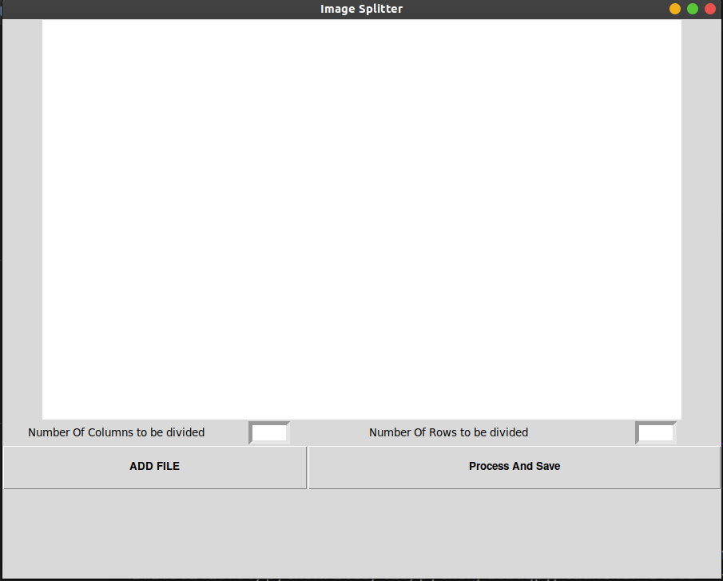
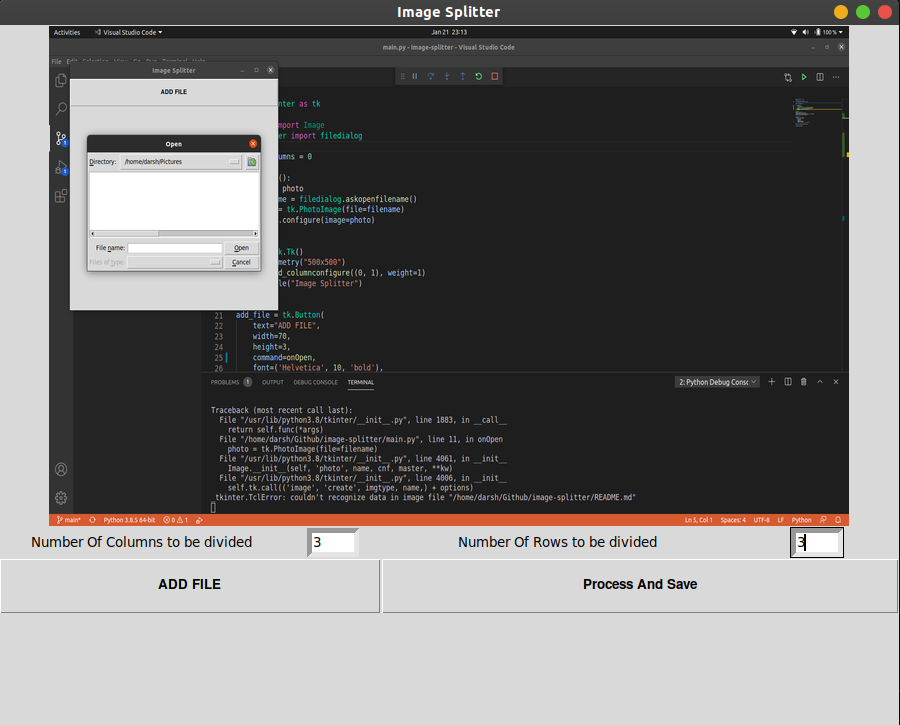
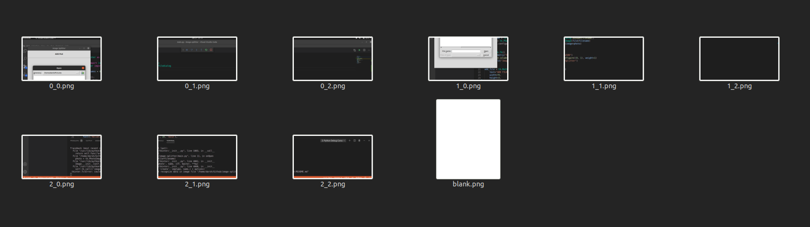

# Image Splitter
This is a python program which splits an image input into multiple images for printing or decorating purposes.<br>
Steps to use:-
<ol>
<li>Add a Photo to be split.
<li>Check the preview
<li>Click on Process and save
<li>The output folder contains the saved split set of images
</ol>
<br>
This program is based on python and uses the following libraries:-
<ul>
<li>Tkinter
<li>Pillow
</ul>

### Libraries installation 
``` bash 
# For Windows
$ pip install tk
$ pip install pillow

# For linux
$ sudo apt-get install python3-tk
$ pip3 install pillow
```

### OUTPUT->>
#### Default Screen
<br>

#### Inputs Entered
<br>

### Output Successful
<br>
#### Saved Output
<br>

